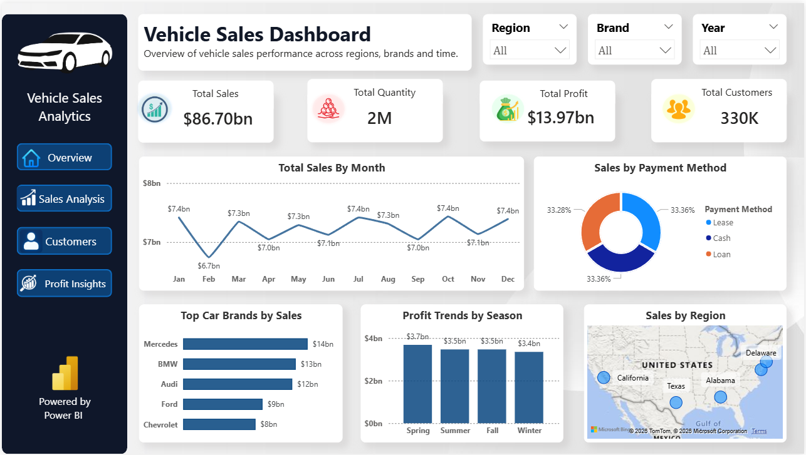
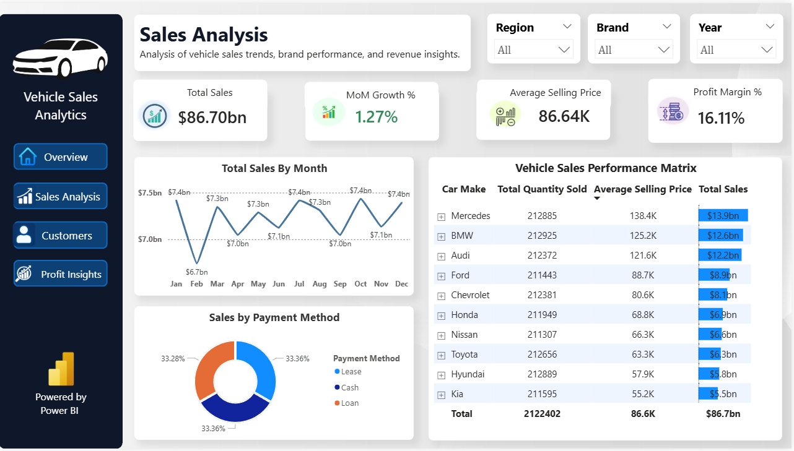
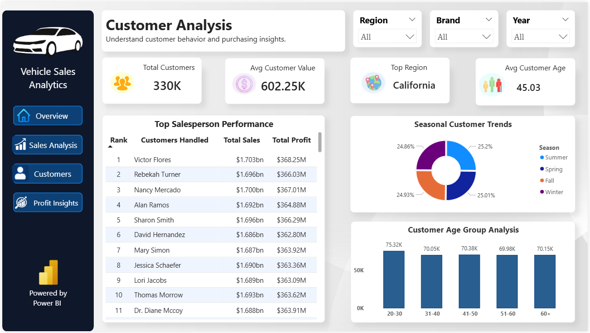
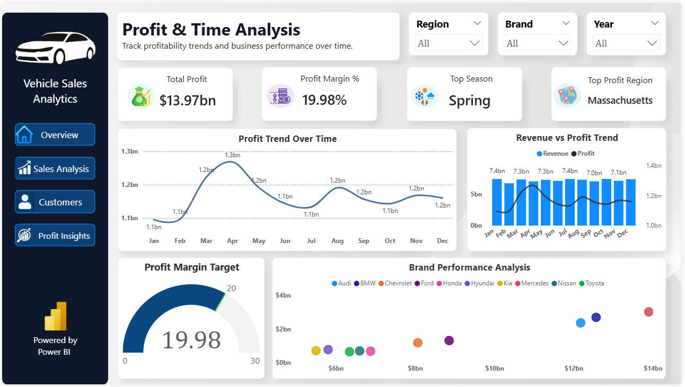

# Vehicle Sales Analytics System

## Project Overview

The Vehicle Sales Analytics System is an end-to-end business intelligence project developed using Power BI, SQL, and Python to analyze vehicle sales performance, customer behavior, regional trends, and profitability insights.

This project transforms raw vehicle sales data into interactive analytical dashboards that support data-driven business decision-making. The dashboard provides sales trend analysis, customer insights, revenue monitoring, profit analysis, and regional performance tracking through modern visualizations and KPI reporting.

The project demonstrates data cleaning, SQL analysis, Python-based exploratory analysis, DAX calculations, and professional Power BI dashboard development.
---

## Business Problem

Vehicle sales companies generate large amounts of transactional data related to sales, customers, regions, vehicle models, and profitability. However, raw data alone does not provide meaningful business insights.

The goal of this project is to analyze vehicle sales data and build an interactive analytics system that helps businesses:

- Monitor overall sales performance
- Track revenue and profit trends
- Identify top-performing vehicle brands and models
- Analyze customer purchasing behavior
- Understand regional sales distribution
- Evaluate seasonal and monthly sales trends
- Support strategic business decision-making through data visualization

This dashboard enables management teams to make faster and more informed decisions using interactive business intelligence reports.
---

## Tech Stack

The following technologies and tools were used in this project:

| Technology | Purpose |
|------------|---------|
| Power BI | Interactive dashboard development and data visualization |
| SQL | Data cleaning, transformation, and business analysis queries |
| Python | Exploratory data analysis and preprocessing |
| Pandas | Data manipulation and analysis |
| DAX | KPI calculations and business metrics in Power BI |
| Excel / CSV | Dataset storage and handling |
---

## Dashboard Pages

The Power BI dashboard is divided into multiple analytical pages to provide detailed business insights.

### 1. Overview Dashboard
Provides high-level business KPIs and overall vehicle sales performance summary.

Key Highlights:
- Total Sales
- Total Quantity Sold
- Total Profit
- Total Customers
- Regional Sales Overview
- Sales Distribution Analysis

---

### 2. Sales Analysis Dashboard
Focused on detailed sales performance and revenue analysis.

Key Highlights:
- Monthly Sales Trends
- Profit Margin Analysis
- Average Selling Price
- Payment Method Distribution
- Vehicle Performance Matrix
- Revenue Insights

---

### 3. Customer Insights Dashboard
Analyzes customer behavior and purchasing patterns.

Key Highlights:
- Customer Segmentation
- Gender-based Analysis
- Customer Type Analysis
- Customer Distribution
- Purchasing Behavior Insights

---

### 4. Profit & Time Analysis Dashboard
Provides profitability and seasonal business insights.

Key Highlights:
- Monthly Profit Trends
- Seasonal Sales Analysis
- Profit Distribution
- Time-based Performance Analysis
- Revenue vs Profit Comparison

---

## Key Features

- Multi-page interactive Power BI dashboard
- Professional sidebar navigation system
- Dynamic KPI cards with DAX calculations
- Revenue and profit trend analysis
- Customer behavior analysis
- Regional sales performance tracking
- Vehicle brand and model performance analysis
- Interactive slicers and filters
- Conditional formatting and analytical matrix reporting
- Modern business dashboard UI design
- SQL-based business query analysis
- Python exploratory data analysis using Pandas

---

## KPIs Used

The dashboard includes several business KPIs to monitor sales performance and profitability.

| KPI | Description |
|-----|-------------|
| Total Sales | Overall revenue generated from vehicle sales |
| Total Quantity Sold | Total number of vehicles sold |
| Total Profit | Overall profit generated |
| Total Customers | Number of customers involved in transactions |
| MoM Growth % | Month-over-Month sales growth percentage |
| Profit Margin % | Profitability percentage analysis |
| Average Selling Price | Average revenue generated per vehicle |
| Top Performing Brand | Highest revenue-generating vehicle brand |

---

## Project Folder Structure

```bash
Vehicle-Sales-Analytics-System/
│
├── data/
│   └── vehicle_sales_cleaned.csv
│
├── sql/
│   ├── data_cleaning.sql
│   ├── basic_analysis.sql
│   ├── business_queries.sql
│   └── advanced_analysis.sql
│
├── python_scripts/
│   └── vehicle_sales_analysis.ipynb
│
├── powerbi/
│   └── Vehicle_Sales_Analytics_System.pbix
│
├── screenshots/
│   ├── overview_page.png
│   ├── sales_analysis.png
│   ├── customer_analysis.png
│   └── profit_analysis.png
│
├── requirements.txt
├── .gitignore
└── README.md
```
---

## Dashboard Screenshots

### Overview Dashboard



---

### Sales Analysis Dashboard



---

### Customer Insights Dashboard



---

### Profit & Time Analysis Dashboard



---

## Key Business Insights

- Revenue trends help identify high-performing sales periods and seasonal demand patterns.
- Certain vehicle brands contribute significantly higher revenue compared to others.
- Customer purchasing behavior varies based on payment methods and customer categories.
- Regional analysis helps identify top-performing and underperforming markets.
- Profitability analysis supports better pricing and business strategy decisions.
- Interactive dashboards improve business monitoring and executive reporting efficiency.

---

## Future Enhancements

- Integration with real-time vehicle sales databases
- Predictive sales forecasting using machine learning
- Mobile-responsive Power BI dashboard design
- Advanced customer segmentation analysis
- Dynamic tooltip pages and drill-through reports
- Cloud deployment and automated data refresh pipelines

---

## Conclusion

The Vehicle Sales Analytics System demonstrates the complete workflow of a real-world data analytics project, including data cleaning, SQL analysis, Python-based exploration, DAX calculations, and interactive Power BI dashboard development.

This project highlights the use of business intelligence techniques to transform raw sales data into meaningful business insights for better decision-making.
